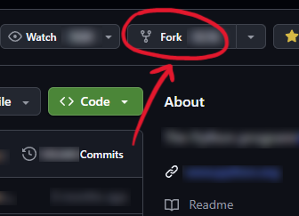
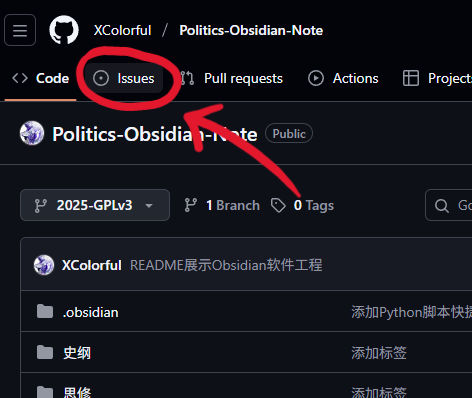

核心考案的[Obsidian](https://obsidian.md/)笔记，粉刷[绿墙](https://github.com/XColorful)以自勉，公开[仓库](https://github.com/XColorful/Politics-Obsidian-Note)以共勉

|笔记内容|脚本|其他|
|:-:|:-:|:--|
|[马原](马原/马克思主义基本原理.md)|[Python](https://www.python.org/)|[Obsidian](https://obsidian.md/download)|
|[思修](思修/思想道德与法治.md)|[移除行首标签](移除行首标签.cmd)|[Github Desktop](https://github.com/apps/desktop)|
|[史纲](史纲/中国近代史纲要.md)|[恢复行首标签](恢复行首标签.cmd)|[笔记仓库页面](https://github.com/XColorful/Politics-Obsidian-Note)|
|[毛中特](毛中特/毛泽东思想和中国特色社会主义理论体系概论.md)||[笔记仓库Issue](https://github.com/XColorful/Politics-Obsidian-Note/issues)|
|[新思想](新思想/习近平新时代中国特色社会主义思想概论.md)||[笔记仓库Wiki](https://github.com/XColorful/Politics-Obsidian-Note/wiki)|

## 使用说明

### 下载笔记

#### 1. 下载Github Desktop

|说明|图片|
|:--|:-:|
|下载[Github Desktop](https://desktop.github.com/download/)|安装界面：|
|到[仓库页面](https://github.com/XColorful/Politics-Obsidian-Note)点击绿色的`<>Code ▼`，点击`Open with Github Desktop`||
|点击`Open`||
|在`Local path`里选择本地仓库目录（`Politics-Obsidian-Note`），点击`Clone`等待下载||

#### 2. 下载Obsidian

|说明|图片|
|:--|:-:|
|下载[Obsidian](https://obsidian.md/download)||
|打开本地仓库（Open folder as vault）||
|选择本地仓库目录（`Politics-Obsidian-Note`）||
|点击`信任作者并启用插件`则自动与[笔记展示](https://github.com/XColorful/Politics-Obsidian-Note#笔记展示)效果相同||

### 同步笔记更新

|说明|图片|
|:--|:-:|
|打开[Github Desktop](https://github.com/apps/desktop)，点击`Fetch origin`||
|如有更新则点击`Pull origin`即可||
|（可选）点击`Current branch`，可以查看是否有其他分支（Branch）更新||

### 个性化与协作

#### 1. Fork仓库

|说明|图片|
|:--|:-:|
|到[仓库页面](https://github.com/XColorful/Politics-Obsidian-Note)点击`<>Code ▼`右上角的`Fork`||
|点击`Create fork`||
|在自己的仓库界面[下载笔记](#下载笔记)，即可得到自己的专属版本||

#### 2. 提交修改

|说明|图片|
|:--|:-:|
|对笔记进行修改后（如添加自己的内容、修改笔记错误等），在[Github Desktop](https://github.com/apps/desktop)里填写`Summary`、`Description`（可选）后，点击`Commit x files to xxx`即可||

#### 3. 多人协作

关于如何使用分支（Branch）的简要介绍如下，详细可以请教程序员朋友或AI：
- 当我开始学习马哲，并添加笔记时，为马哲[新建分支](#新建分支（Branch）)，即为整个仓库创建一个副本
> 在[新建分支](#新建分支（Branch）)后，切换分支即可快速恢复到修改前/修改后
- 当学习完马哲，开始学思修时，将马哲的分支[合并到主分支](#合并分支)，并再为思修[新建分支](#新建分支（Branch）)
- 这样，在马哲的Pull Request里就只包含对马哲部分的修改，每个PR的修改都与PR名称相符

##### 新建分支（Branch）

|说明|图片|
|:--|:-:|
|点击`New branch`||
|发布分支||
|提交修改（Commit）||

##### 合并分支

|说明|图片|
|:--|:-:|
|在[Github Desktop](https://github.com/apps/desktop)里点击`Create Pull Request`||
|在弹出的网页里点击`Create Pull Request`||

#### 4. 笔记Issue

提出建议/对笔记有疑问/请教使用方式，都可以[创建一个Issue](https://github.com/XColorful/Politics-Obsidian-Note/issues/new)

|说明|图片|
|:--|:-:|
|到[仓库界面](https://github.com/XColorful/Politics-Obsidian-Note)点击左上角的[Issue](https://github.com/XColorful/Politics-Obsidian-Note/issues)||
|点击绿色的`New issue`||
|描述完之后点击`Create`即可||

### 脚本

#### 移除行首标签
> 临时移除所有笔记第一行的'#选择题'、'#重点'、'#非重点'标签，让[关系图谱](https://publish.obsidian.md/help-zh/%E6%A0%B8%E5%BF%83%E6%8F%92%E4%BB%B6/%E5%85%B3%E7%B3%BB%E5%9B%BE%E8%B0%B1)（`Ctrl` + `G`）更纯净

|说明|图片|
|:--|:-:|
|下载[Python](https://www.python.org/)||
|运行仓库根目录的`移除行首标签.cmd`或`恢复行首标签.cmd`即可（打开后按一下回车就行）|[移除行首标签](移除行首标签.cmd)[恢复行首标签](恢复行首标签.cmd)|

> 💡使用建议（避坑指南）：
> - 运行前：若已修改笔记，请务必先完成`Commit x files to xxx`
> - 纯查看：运行脚本查看完图谱，再`恢复行首标签`后如果[Github Desktop](https://github.com/apps/desktop)里修改没清除，则直接全选修改，右键点击`Discard changes`即可还原
> - 有修改：若在移除标签期间修改了笔记，请先运行`恢复行首标签.cmd`，确认无误后再`Commit x files to xxx`